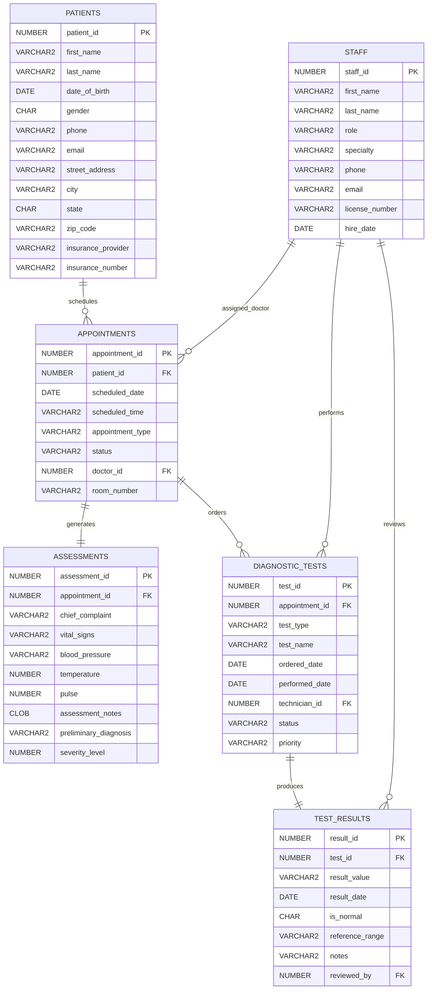

# Entity Relationship Diagram
## MedFirst Diagnostic Center Database

---

## ERD Overview

The following ERD shows the relationships between all entities in the MedFirst Diagnostic Center database using Crow's Foot notation.

### Key Relationships:
- **PATIENTS** can have multiple **APPOINTMENTS** (1:M)
- Each **APPOINTMENT** has one **ASSESSMENT** (1:1)
- **APPOINTMENTS** can generate multiple **DIAGNOSTIC_TESTS** (1:M)
- Each **DIAGNOSTIC_TEST** produces one **TEST_RESULT** (1:1)
- **STAFF** members can be assigned to multiple appointments and tests (1:M)

---

## ERD Diagram

---

## Relationship Cardinality Details

### PATIENTS → APPOINTMENTS
- **Type:** One-to-Many (1:M)
- **Business Rule:** One patient can have many appointments over time
- **Mandatory:** No - patients can exist without appointments

### APPOINTMENTS → ASSESSMENTS
- **Type:** One-to-One (1:1)
- **Business Rule:** Each appointment generates exactly one assessment
- **Mandatory:** Yes - every completed appointment must have an assessment

### APPOINTMENTS → DIAGNOSTIC_TESTS
- **Type:** One-to-Many (1:M)
- **Business Rule:** An appointment can order multiple diagnostic tests
- **Mandatory:** No - not all appointments require tests

### DIAGNOSTIC_TESTS → TEST_RESULTS
- **Type:** One-to-One (1:1)
- **Business Rule:** Each test produces one result record
- **Mandatory:** Yes - completed tests must have results

### STAFF → APPOINTMENTS (Doctor)
- **Type:** One-to-Many (1:M)
- **Business Rule:** A doctor can handle multiple appointments
- **Mandatory:** Yes - appointments must have an assigned doctor

### STAFF → DIAGNOSTIC_TESTS (Technician)
- **Type:** One-to-Many (1:M)
- **Business Rule:** A technician can perform multiple tests
- **Mandatory:** No - tests may be pending technician assignment

### STAFF → TEST_RESULTS (Reviewer)
- **Type:** One-to-Many (1:M)
- **Business Rule:** A doctor can review multiple test results
- **Mandatory:** Yes - results must be reviewed by qualified staff

---

## Design Decisions

### Why These Entities?

1. **PATIENTS** - Core entity storing all patient demographics
2. **STAFF** - Unified entity for all employees (doctors, nurses, technicians)
3. **APPOINTMENTS** - Tracks all patient visits and scheduling
4. **ASSESSMENTS** - Captures medical evaluation during visits
5. **DIAGNOSTIC_TESTS** - Manages all ordered tests
6. **TEST_RESULTS** - Stores outcomes of diagnostic procedures

### Key Design Choices:

- **Unified STAFF table:** Rather than separate Doctor, Nurse, Technician tables, we use a role attribute for flexibility
- **Separate ASSESSMENTS:** Allows detailed medical data without cluttering APPOINTMENTS
- **TEST_RESULTS as separate entity:** Enables multiple result entries and future expansion
- **No separate Insurance table:** Kept simple as insurance details are attributes of PATIENTS

---

## Indexes Strategy

### Primary Indexes (Automatic on PKs):
- `patient_id` on PATIENTS
- `staff_id` on STAFF
- `appointment_id` on APPOINTMENTS
- `assessment_id` on ASSESSMENTS
- `test_id` on DIAGNOSTIC_TESTS
- `result_id` on TEST_RESULTS

### Recommended Secondary Indexes:
- `PATIENTS(last_name, first_name)` - Name searches
- `APPOINTMENTS(patient_id, scheduled_date)` - Patient history
- `APPOINTMENTS(scheduled_date, scheduled_time)` - Daily schedules
- `DIAGNOSTIC_TESTS(appointment_id)` - Test lookup by visit
- `TEST_RESULTS(test_id)` - Result retrieval
