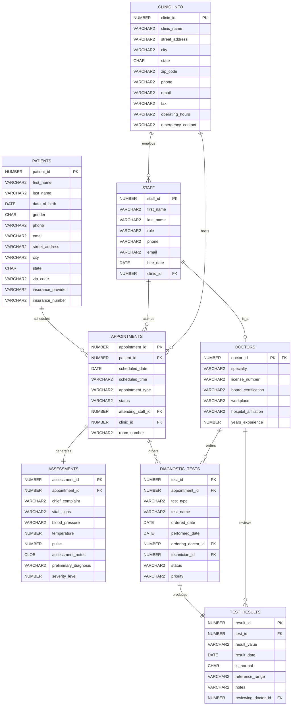

# Entity Relationship Diagram
## MedFirst Diagnostic Center Database

---

## ERD Overview

This ERD shows the relationships between all entities in the MedFirst Diagnostic Center database using Crow's Foot notation.

### Key Relationships:
- **CLINIC_INFO** employs **STAFF** and hosts **APPOINTMENTS** (1:M)
- **STAFF** can be **DOCTORS** with specialized attributes (1:1 optional)
- **PATIENTS** schedule multiple **APPOINTMENTS** (1:M)
- Each **APPOINTMENT** generates one **ASSESSMENT** (1:1)
- **APPOINTMENTS** can order multiple **DIAGNOSTIC_TESTS** (1:M)
- Each **DIAGNOSTIC_TEST** produces one **TEST_RESULT** (1:1)
- **DOCTORS** order tests and review results (1:M)

---

## ERD Diagram

```mermaid
erDiagram
    CLINIC_INFO ||--o{ STAFF : "employs"
    STAFF ||--o| DOCTORS : "is_a"
    PATIENTS ||--o{ APPOINTMENTS : "schedules"
    APPOINTMENTS ||--|| ASSESSMENTS : "generates"
    APPOINTMENTS ||--o{ DIAGNOSTIC_TESTS : "orders"
    DIAGNOSTIC_TESTS ||--|| TEST_RESULTS : "produces"
    STAFF ||--o{ APPOINTMENTS : "attends"
    DOCTORS ||--o{ DIAGNOSTIC_TESTS : "orders"
    DOCTORS ||--o{ TEST_RESULTS : "reviews"
    CLINIC_INFO ||--o{ APPOINTMENTS : "hosts"

    CLINIC_INFO {
        NUMBER clinic_id PK
        VARCHAR2 clinic_name
        VARCHAR2 street_address
        VARCHAR2 city
        CHAR state
        VARCHAR2 zip_code
        VARCHAR2 phone
        VARCHAR2 email
        VARCHAR2 fax
        VARCHAR2 operating_hours
        VARCHAR2 emergency_contact
    }

    PATIENTS {
        NUMBER patient_id PK
        VARCHAR2 first_name
        VARCHAR2 last_name
        DATE date_of_birth
        CHAR gender
        VARCHAR2 phone
        VARCHAR2 email
        VARCHAR2 street_address
        VARCHAR2 city
        CHAR state
        VARCHAR2 zip_code
        VARCHAR2 insurance_provider
        VARCHAR2 insurance_number
    }

    STAFF {
        NUMBER staff_id PK
        VARCHAR2 first_name
        VARCHAR2 last_name
        VARCHAR2 role
        VARCHAR2 phone
        VARCHAR2 email
        DATE hire_date
        NUMBER clinic_id FK
    }

    DOCTORS {
        NUMBER doctor_id PK "FK"
        VARCHAR2 specialty
        VARCHAR2 license_number
        VARCHAR2 board_certification
        VARCHAR2 workplace
        VARCHAR2 hospital_affiliation
        NUMBER years_experience
    }

    APPOINTMENTS {
        NUMBER appointment_id PK
        NUMBER patient_id FK
        DATE scheduled_date
        VARCHAR2 scheduled_time
        VARCHAR2 appointment_type
        VARCHAR2 status
        NUMBER attending_staff_id FK
        NUMBER clinic_id FK
        VARCHAR2 room_number
    }

    ASSESSMENTS {
        NUMBER assessment_id PK
        NUMBER appointment_id FK
        VARCHAR2 chief_complaint
        VARCHAR2 vital_signs
        VARCHAR2 blood_pressure
        NUMBER temperature
        NUMBER pulse
        CLOB assessment_notes
        VARCHAR2 preliminary_diagnosis
        NUMBER severity_level
    }

    DIAGNOSTIC_TESTS {
        NUMBER test_id PK
        NUMBER appointment_id FK
        VARCHAR2 test_type
        VARCHAR2 test_name
        DATE ordered_date
        DATE performed_date
        NUMBER ordering_doctor_id FK
        NUMBER technician_id FK
        VARCHAR2 status
        VARCHAR2 priority
    }

    TEST_RESULTS {
        NUMBER result_id PK
        NUMBER test_id FK
        VARCHAR2 result_value
        DATE result_date
        CHAR is_normal
        VARCHAR2 reference_range
        VARCHAR2 notes
        NUMBER reviewing_doctor_id FK
    }
```

---

## Relationship Details

### CLINIC_INFO → STAFF
- **Type:** One to Many (1:M)
- **Rule:** A clinic employs multiple staff members
- **Mandatory:** Staff must be assigned to a clinic

### STAFF → DOCTORS
- **Type:** One to One (1:1, optional)
- **Rule:** Staff members with role 'Doctor' have additional doctor-specific attributes
- **Mandatory:** No, only doctors have entries in DOCTORS table

### PATIENTS → APPOINTMENTS
- **Type:** One to Many (1:M)
- **Rule:** Patients can schedule multiple appointments
- **Mandatory:** No, new patients may not have appointments yet

### APPOINTMENTS → ASSESSMENTS
- **Type:** One to One (1:1)
- **Rule:** Each completed appointment has one assessment
- **Mandatory:** Yes, for completed appointments

### APPOINTMENTS → DIAGNOSTIC_TESTS
- **Type:** One to Many (1:M)
- **Rule:** An appointment can order several tests
- **Mandatory:** No, not all visits require testing

### DIAGNOSTIC_TESTS → TEST_RESULTS
- **Type:** One to One (1:1)
- **Rule:** Each completed test has one result
- **Mandatory:** Yes, for completed tests

### DOCTORS → DIAGNOSTIC_TESTS
- **Type:** One to Many (1:M)
- **Rule:** Doctors order multiple tests for patients
- **Mandatory:** Yes, tests require a doctor's order

### DOCTORS → TEST_RESULTS
- **Type:** One to Many (1:M)
- **Rule:** Doctors review multiple test results
- **Mandatory:** Yes, results need doctor review

### CLINIC_INFO → APPOINTMENTS
- **Type:** One to Many (1:M)
- **Rule:** A clinic hosts many appointments
- **Mandatory:** Yes, appointments happen at a specific clinic

---

## Design Decisions

### Entity Choices

1. **CLINIC_INFO** - Stores clinic location and contact information
2. **PATIENTS** - Patient demographics and insurance data
3. **STAFF** - All employees (doctors, nurses, technicians)
4. **DOCTORS** - Additional attributes for doctors only
5. **APPOINTMENTS** - Scheduling and visit tracking
6. **ASSESSMENTS** - Medical evaluation data from each visit
7. **DIAGNOSTIC_TESTS** - Test orders and execution tracking
8. **TEST_RESULTS** - Lab and diagnostic test outcomes

### Design Notes

- **Subtype relationship for DOCTORS:** Uses table-per-type approach where DOCTORS extends STAFF. This keeps general employee data in STAFF while doctor-specific fields (specialty, license, certifications) stay separate.
- **Separate ASSESSMENTS table:** Keeps appointment data clean and allows detailed medical notes without bloating the appointments table.
- **Separate TEST_RESULTS:** Makes it easier to query test outcomes independently and allows for future expansion.
- **CLINIC_INFO:** Supports multi-clinic operations if the center expands.

---

## Index Strategy

### Primary Indexes (created automatically):
- `patient_id` on PATIENTS
- `staff_id` on STAFF
- `doctor_id` on DOCTORS
- `clinic_id` on CLINIC_INFO
- `appointment_id` on APPOINTMENTS
- `assessment_id` on ASSESSMENTS
- `test_id` on DIAGNOSTIC_TESTS
- `result_id` on TEST_RESULTS

### Recommended Secondary Indexes:
- `PATIENTS(last_name, first_name)` for patient lookup
- `APPOINTMENTS(patient_id, scheduled_date)` for patient history
- `APPOINTMENTS(scheduled_date, scheduled_time)` for daily schedules
- `APPOINTMENTS(clinic_id, scheduled_date)` for clinic scheduling
- `DIAGNOSTIC_TESTS(appointment_id)` for test lookup by visit
- `DIAGNOSTIC_TESTS(ordering_doctor_id)` for doctor's ordered tests
- `TEST_RESULTS(test_id)` for result retrieval
- `TEST_RESULTS(reviewing_doctor_id)` for doctor's review queue
