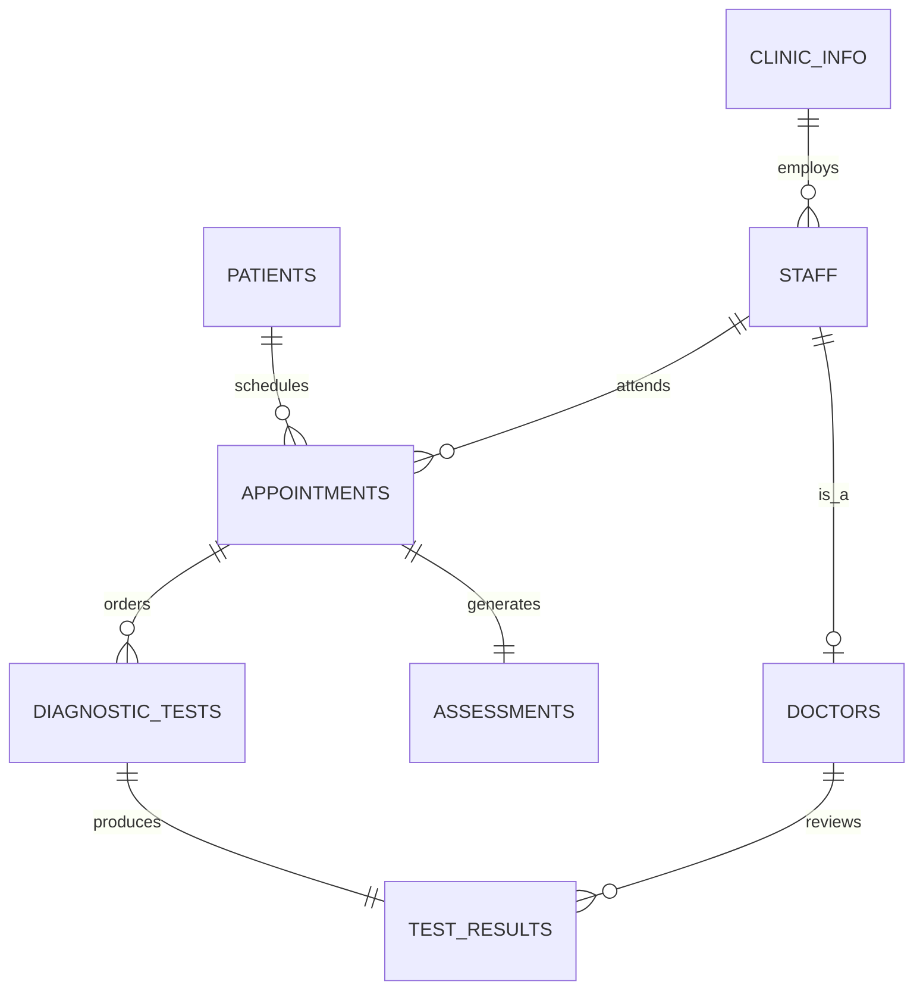

### Database Design Project

#### MedFirst Diagnostic Center

  

<small>

  

**Team Members:**

- Kyle Kopczynski (Project Manager)

- Karthik Nittala (Business Analyst)

- John Perrotti (Database Administrator)

  

</small>

  

---

  

### Project Overview

  

<small>

  

- **Business Choice:** MedFirst Diagnostic Center

- **Description:** Diagnostic center & ER providing testing, assessments, and immediate care.

- **Goal:** Design a relational database for patients, appointments, staff, and results.

- **Consensus:** Chosen for its comprehensive scope (Patients -> Doctors -> Tests).

  

</small>

  

---

  

### Team Collaboration

#### Roles & Responsibilities

  

<small>

  

- **Kyle Kopczynski (PM):** Task management, timeline creation, coordination, final summary.

- **Karthik Nittala (BA):** Logical/Conceptual Design, Entity identification, Normalization, ERD.

- **John Perrotti (DBA):** Physical Design, DDL & DML Scripts, Database implementation.

  

</small>

  

---

  

### Logical Design

  

<small>

  

**Data Model & Entities:**

- Identified 8 core entities.

- **Key Entities:**

- `PATIENTS`: Demographics & insurance.

- `STAFF` / `DOCTORS`: Personnel.

- `APPOINTMENTS` / `ASSESSMENTS`: Visits & evaluations.

- `DIAGNOSTIC_TESTS` / `TEST_RESULTS`: Orders & outcomes.

- `CLINIC_INFO`: Facility details.

  

</small>

  

---

  

### Data Quality Assurance

  

<small>

  

- **Referential Integrity:** Foreign keys ensure all records (Tests, Appointments) link to valid entities.

- **Input Validation:**

- `CHECK` constraints for formats (e.g., BP `120/80`).

- `NOT NULL` constraints for mandatory fields.

- **Logic Enforcement:** Triggers ensure business rules (e.g., only Staff with 'Doctor' role can be in `DOCTORS` table).

  

</small>

  

---

  

### Security & Access Control

  

<small>

  

- **Role-Based Design:** Schema distinguishes between `DOCTORS`, `STAFF`, and `ADMIN` roles.

- **Auditability:**

- `ordering_doctor_id` tracks who authorized tests.

- `reviewing_doctor_id` tracks who validated results.

- **Data Privacy:** Patient demographics separated from clinical assessments to support future access control policies.

  

</small>

  

---

  
  

### Normalization

#### 3rd Normal Form (3NF)

  

<small>

  

- **1NF:** Atomic attributes; no repeating groups.

- **2NF:** Non-key attributes depend on full PK.

- **3NF:** No transitive dependencies.

- *Example:* Zip Code determines City/State (kept for address standard).

- **Result:** Minimized redundancy, improved integrity.

  

</small>

  

---

  

### Entity Relationship Diagram

  

<small>

  

*(Simplified view)*

  

</small>

  

---

  

### Physical Design
<small>

**Turning Plans into Tables:**
- We converted our logical "entities" into real Oracle tables.
- **Data Types:**
    - `VARCHAR2`: For text like Names and Addresses.
    - `NUMBER`: For IDs, Temperature, and Pulse.
    - `DATE`: For Birthdays and Appointment times.

</small>

---

### The Rules

<small>

**Constraints act as the database's security guards:**

- **Primary Keys (PK):** The "Unique ID".
    - *Rule:* No duplicates allowed.
    - *Example:* Every `patient_id` is unique. You can't have two Patient #100s.

- **Foreign Keys (FK):** The "Link".
    - *Rule:* You can't point to something that doesn't exist.
    - *Example:* An appointment *must* be linked to a real patient in the system.

</small>

---

### Check Constraints

<small>

**Automatic validation to prevent bad data:**

- **What they do:** Reject data that breaks business rules.
- **Real Examples from our Project:**
    - **Gender:** Must be 'M', 'F', or 'O'.
    - **Severity:** Must be 1 (Low) to 5 (Critical).
    - **Status:** Must be 'Scheduled', 'Completed', or 'Cancelled'.

</small>

  

---

  

### Database Scripts

  

<small>

  

- **DDL Scripts:**

- Tables with full constraints.

- Sequences & Triggers for IDs.

- Indexes for performance.

- **DML Scripts:**

- Realistic sample data (5+ rows/table).

- Verification queries proving integrity.

  

</small>

  

---

### Project Summary

  

<small>

  

- **Conclusion:**

- Successfully models a complex diagnostic environment.

- Ensures data accuracy for medical records.

- Supports essential daily operation queries.

- **Value:** Robust backend is crucial for patient safety and efficiency.

  

</small>

  

---

  

### Thank you

  

