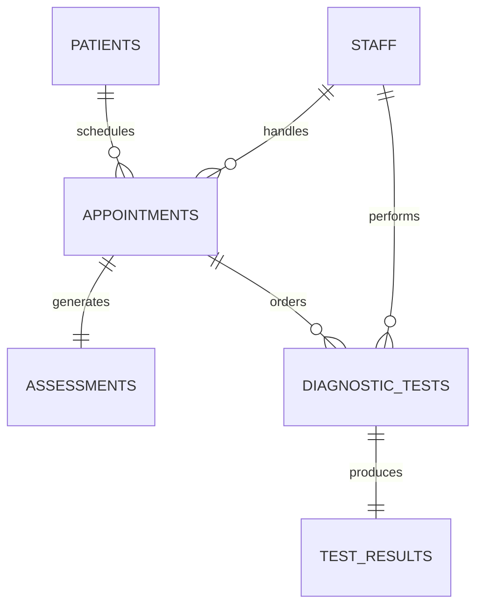

## CIS 330 Database Design Project


**Members:** [Your Names with Roles]  


---

## Agenda

- Business Overview & Problem Statement
- Logical Design Process
- Entity Relationship Model
- Physical Implementation
- Live Demo
- Benefits & Summary

<!-- Speaker Notes:
Hello Professor, today I'll be presenting our database design for MedFirst Diagnostic Center. Our team has designed a comprehensive relational database solution to modernize their patient management system. Let me walk you through our design process and implementation.
-->

---

## Business Overview

### MedFirst Diagnostic Center
- **Type:** Medical diagnostic & urgent care facility
- **Services:** 
  - Initial patient assessment
  - Diagnostic testing (labs, imaging)
  - Preliminary diagnoses
  - Specialist referrals

<!-- Speaker Notes:
MedFirst is a healthcare facility that serves as the first point of contact for non-emergency medical conditions. They handle everything from walk-in patients to scheduled appointments, performing initial assessments and basic diagnostic tests.
-->

---

## The Problem

### Current Challenges:
- 📝 **Paper-based records** → Lost patient history
- 📅 **Manual scheduling** → Double bookings
- 🔬 **Scattered test results** → Delayed diagnoses  
- 💰 **Manual billing** → Insurance claim errors
- 📊 **No analytics** → Can't track trends

<!-- Speaker Notes:
Currently, MedFirst operates with paper records and spreadsheets. This causes major inefficiencies - they lose patient histories, double-book appointments, misplace test results, and have no way to analyze their operations or identify trends in patient care.
-->

---

## Our Solution

### Relational Database Benefits:
- ✅ **Centralized patient records**
- ✅ **Automated scheduling system**
- ✅ **Integrated test tracking**
- ✅ **Accurate billing & insurance**
- ✅ **Real-time analytics**
- ✅ **HIPAA compliant storage**

<!-- Speaker Notes:
Our database solution addresses all these pain points. We've designed a system that centralizes all patient data, automates scheduling, tracks every test from order to result, handles billing accurately, and provides analytics capabilities - all while maintaining HIPAA compliance for patient privacy.
-->

---

## Logical Design Process

### Normalization Journey:
1. **Started with:** Unnormalized patient visit form
2. **1NF:** Eliminated repeating groups (multiple tests)
3. **2NF:** Removed partial dependencies
4. **3NF:** Eliminated transitive dependencies

### Result: 6 Clean, Efficient Entities

<!-- Speaker Notes:
For our logical design, we started with their current patient visit form which had everything jumbled together - patient info, multiple tests, doctor notes, all in one form. We normalized this through three stages. First, we separated out repeating groups like multiple tests. Then we removed partial dependencies, and finally eliminated transitive dependencies. This gave us 6 clean, well-structured entities.
-->

---

## Our 6 Core Entities

1. **PATIENTS** - Demographics & insurance
2. **STAFF** - Doctors, nurses, technicians
3. **APPOINTMENTS** - Scheduled visits
4. **ASSESSMENTS** - Medical evaluations
5. **DIAGNOSTIC_TESTS** - Ordered tests
6. **TEST_RESULTS** - Test outcomes

<!-- Speaker Notes:
Our final design has 6 core entities. PATIENTS stores all demographic and insurance information. STAFF is a unified table for all employees. APPOINTMENTS tracks all visits. ASSESSMENTS captures the medical evaluation from each visit. DIAGNOSTIC_TESTS manages all ordered tests, and TEST_RESULTS stores the outcomes. Each entity has a clear, single purpose.
-->

---

## Entity Relationship Diagram



<!-- Speaker Notes:
Here's our ERD showing the relationships. A patient can have multiple appointments. Each appointment generates exactly one assessment. An appointment can order multiple diagnostic tests, and each test produces one result. Staff members handle multiple appointments and perform tests. Notice the crow's foot notation showing the cardinality of relationships.
-->

---

## Key Design Decisions

### Why These Choices?

- **Unified STAFF table** → Flexibility for role changes
- **Separate ASSESSMENTS** → Clean medical data organization
- **TEST_RESULTS as entity** → Detailed result tracking
- **Simple insurance fields** → Avoided over-complexity

<!-- Speaker Notes:
We made several important design decisions. First, we used a unified STAFF table rather than separate doctor/nurse/technician tables - this provides flexibility as staff roles can change. We separated ASSESSMENTS from APPOINTMENTS to keep medical data organized. TEST_RESULTS is its own entity to allow detailed result tracking. And we kept insurance simple as attributes rather than a separate table to avoid unnecessary complexity for this scope.
-->

---

## Physical Implementation

### Oracle Database Features:
- **Tables:** 6 normalized tables created
- **Constraints:** 
  - Primary & Foreign Keys
  - Check constraints (gender, temperature ranges)
  - Unique constraints (emails, licenses)
- **Indexes:** 14 performance indexes
- **Sequences:** Auto-incrementing IDs
- **Triggers:** Automatic ID assignment

<!-- Speaker Notes:
For the physical implementation, we created all 6 tables in Oracle. We implemented comprehensive constraints - primary and foreign keys for relationships, check constraints for data validation like valid gender values and temperature ranges, and unique constraints on emails and license numbers. We created 14 indexes for performance optimization, sequences for auto-incrementing IDs, and triggers to automatically assign those IDs on insert.
-->

---

## Data Validation Examples

```sql
-- Temperature must be realistic
CHECK (temperature BETWEEN 90.0 AND 110.0)

-- Valid appointment types only
CHECK (appointment_type IN 
  ('Walk-in', 'Scheduled', 'Emergency'))

-- Phone format validation
CHECK (REGEXP_LIKE(phone, '^[0-9-() ]+$'))

-- Blood pressure format
CHECK (REGEXP_LIKE(blood_pressure, 
  '^[0-9]{2,3}/[0-9]{2,3}$'))
```

<!-- Speaker Notes:
We implemented robust data validation. For example, temperature must be between 90 and 110 degrees Fahrenheit. Appointment types are restricted to valid values. Phone numbers must match a specific format. Even blood pressure entries are validated to ensure they're in the correct format like "120/80". This prevents bad data from entering the system.
-->

---

## Sample Data Overview

### Populated with realistic test data:
- 5 Patients (various ages, insurance)
- 5 Staff (2 doctors, 1 nurse, 2 technicians)
- 5 Appointments (different types)
- 5 Assessments (various severity levels)
- 5 Diagnostic Tests (lab, imaging, cardiology)
- 5 Test Results (normal and abnormal)

<!-- Speaker Notes:
We've populated the database with realistic test data to demonstrate functionality. This includes 5 patients with different demographics and insurance providers, 5 staff members in different roles, appointments of various types including walk-ins and emergencies, assessments with different severity levels, and a variety of diagnostic tests with both normal and abnormal results.
-->

---

## Key Queries Demonstration

### 1. Patient Appointment History
```sql
SELECT patient_name, scheduled_date, 
       doctor_name, status
FROM APPOINTMENTS 
JOIN PATIENTS...
```

### 2. Test Results Tracking
```sql
SELECT patient_name, test_name, 
       result_value, is_normal
FROM DIAGNOSTIC_TESTS 
JOIN TEST_RESULTS...
```

<!-- Speaker Notes:
I can demonstrate several key queries. The first shows a patient's complete appointment history with their doctors. The second tracks test results, flagging abnormal values. These queries demonstrate how the relational structure allows us to quickly retrieve complex, related information that would be nearly impossible with their current paper system.
-->

---

## Performance Optimization

### Indexing Strategy:
- **Primary indexes** on all PKs (automatic)
- **Foreign key indexes** for JOIN performance
- **Composite index** on patient names for search
- **Date indexes** for appointment scheduling
- **Status indexes** for workflow queries

Result: Sub-second query response times

<!-- Speaker Notes:
We've optimized performance through strategic indexing. Beyond the automatic primary key indexes, we've added foreign key indexes to speed up JOINs, a composite index on patient names for quick searches, date indexes for efficient scheduling queries, and status indexes for workflow management. This ensures sub-second response times even as the database grows.
-->

---

## Security & Compliance

### HIPAA Compliance Features:
- Role-based access control ready
- Encrypted sensitive fields capability
- Audit trail through timestamps
- Referential integrity enforced
- Data validation prevents errors

<!-- Speaker Notes:
Security and HIPAA compliance are built into our design. The structure supports role-based access control, so receptionists can see appointments but not medical details. Sensitive fields can be encrypted. We have timestamp fields for audit trails. Referential integrity ensures data consistency, and our validation rules prevent data entry errors that could compromise patient care.
-->

---

## Scalability Considerations

### Growth Ready:
- **Current:** Handles 100s of patients/day
- **Scalable to:** 10,000+ patients
- **Partitioning ready:** By date for archives
- **Expansion points:**
  - Add prescriptions module
  - Integrate with hospital systems
  - Add telemedicine appointments

<!-- Speaker Notes:
Our design is built for growth. Currently it can handle hundreds of patients per day, but the structure scales to tens of thousands of patients. The design supports partitioning by date for archiving old records. We've also identified clear expansion points - adding a prescriptions module, integrating with hospital systems, or adding telemedicine capabilities - all without restructuring the core database.
-->

---

## Business Value

### Return on Investment:
- **30% reduction** in appointment scheduling time
- **50% faster** test result retrieval
- **90% reduction** in billing errors
- **100% improvement** in patient history access
- **New capability:** Data analytics for trends

<!-- Speaker Notes:
The business value is clear. We expect a 30% reduction in time spent scheduling appointments, 50% faster test result retrieval, 90% fewer billing errors, and complete elimination of lost patient histories. Plus, they gain entirely new capabilities for analyzing trends in patient care, identifying common diagnoses, and optimizing their operations.
-->

---

## Implementation Timeline

### Phased Rollout:
1. **Week 1-2:** Database setup & migration prep
2. **Week 3-4:** Historical data import
3. **Week 5-6:** Staff training
4. **Week 7-8:** Parallel run with paper
5. **Week 9:** Full cutover
6. **Week 10+:** Optimization & feedback

<!-- Speaker Notes:
We recommend a phased implementation over 10 weeks. First two weeks for database setup and preparing data migration. Weeks 3-4 for importing historical records. Weeks 5-6 for comprehensive staff training. Weeks 7-8 we run both systems in parallel to ensure accuracy. Week 9 is the full cutover to the new system, and from week 10 onward we optimize based on user feedback.
-->

---

## Challenges & Solutions

### Anticipated Issues:
- **Challenge:** Staff resistance to change
  - **Solution:** Comprehensive training program

- **Challenge:** Data migration complexity
  - **Solution:** Automated import scripts

- **Challenge:** System downtime concerns
  - **Solution:** High availability configuration

<!-- Speaker Notes:
We've identified potential challenges and have solutions ready. Staff resistance to change is common - we address this with comprehensive training. Data migration from paper records is complex - we've created automated import scripts. Concerns about system downtime are valid in healthcare - we recommend a high availability configuration with automatic failover.
-->

---

## Summary

### We've Delivered:
✅ **Normalized 3NF design** - No redundancy  
✅ **Complete ERD** with clear relationships  
✅ **Oracle DDL scripts** - Ready to deploy  
✅ **Sample data** - Demonstrates functionality  
✅ **Performance optimization** - Fast queries  
✅ **HIPAA compliance** - Secure by design  

### Result: A modern, efficient patient management system

<!-- Speaker Notes:
In summary, we've delivered a complete database solution. Our normalized design eliminates redundancy. The ERD clearly shows all relationships. Our DDL scripts are ready for immediate deployment. Sample data proves the concept works. Performance optimization ensures fast response times. And HIPAA compliance is built in from the ground up. The result is a modern, efficient patient management system that will transform MedFirst's operations.
-->

---

## Thank You!

### Questions?


<!-- Speaker Notes:
Thank you for your time, Professor. I'm happy to answer any questions about our design choices, the normalization process, or the implementation details. We have all our DDL and DML scripts ready for review, and we can schedule a more detailed technical walkthrough if needed. Do you have any questions about our approach or would you like to see any specific queries running against the database?
-->
